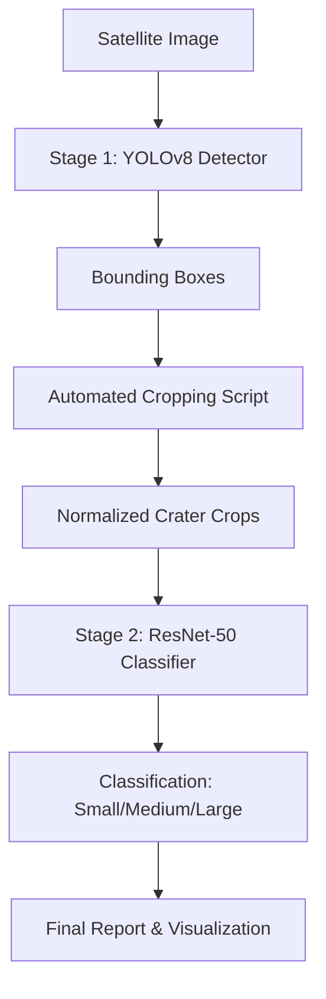

# CraterNet-X: Advanced Multi-Stage Lunar Crater Detection

[]()
[]()
[]()
[]()

**CraterNet-X** is a deep learning-based planetary science project designed to automate the enumeration and size-categorization of lunar craters. By combining state-of-the-art object detection with specialized classification, the system achieves high precision in complex lunar terrains.

---

## 🌓 Project Overview

Traditional manual crater counting is labor-intensive and prone to human error. CraterNet-X addresses this by implementing a **Two-Stage Pipeline**:
1.  **Stage 1 (Detection)**: A YOLOv8 model localizes craters with high recall.
2.  **Stage 2 (Classification)**: A ResNet-50 CNN classifies each detected crater into **Small**, **Medium**, or **Large** based on physical max-dimension thresholds.

### Key Features
- **Hybrid Architecture**: Decouples detection from size-quantification for higher accuracy.
- **Automated Workflow**: End-to-end processing from raw satellite imagery to categorized statistics.
- **Cloud-Ready**: Native support for Google Colab/Kaggle GPU training.
- **Interactive Dashboard**: A Streamlit-based UI for real-time analysis by planetary scientists.

---

## 🏗️ System Architecture



---

## 📂 Project Organization

```text
CraterNet-X/
├── app/                    # Interactive Streamlit Demo
├── data/                   # Dataset root (Moon & Martian samples)
├── docs/                   # Full research documentation & methodology
├── evaluation/             # Metrics, confusion matrices, and test results
├── inference/              # Core production pipeline (CraterNetX Class)
├── models/                 # Final trained weights (.pt)
├── scripts/                # Verification, cropping, and analysis utilities
└── training/               # Multi-stage model trainers
```

---

## 🚀 Quick Start

### 1. Installation
```bash
git clone https://github.com/SayedFaisalShah12/CraterNet-X.git
cd CraterNet-X
pip install -r requirments.txt
```

### 2. Run the Demo
Ensure the trained models are in the `models/` directory, then launch the dashboard:
```bash
streamlit run app/main.py
```

---

## 📊 Research & Methodology
For detailed information on the mathematical thresholds for size categorization and the training hyperparameters, please refer to the [Methodology Document](./docs/methodology.md).

## 📝 Citation
If you use this work in your research, please cite:
```text
Shah, S. F. (2026). CraterNet-X: Multi-Stage Convolutional Neural Networks for Lunar Topographical Analysis.
```

---
*Developed for Planetary Science Research and Computer Vision Applications.*
